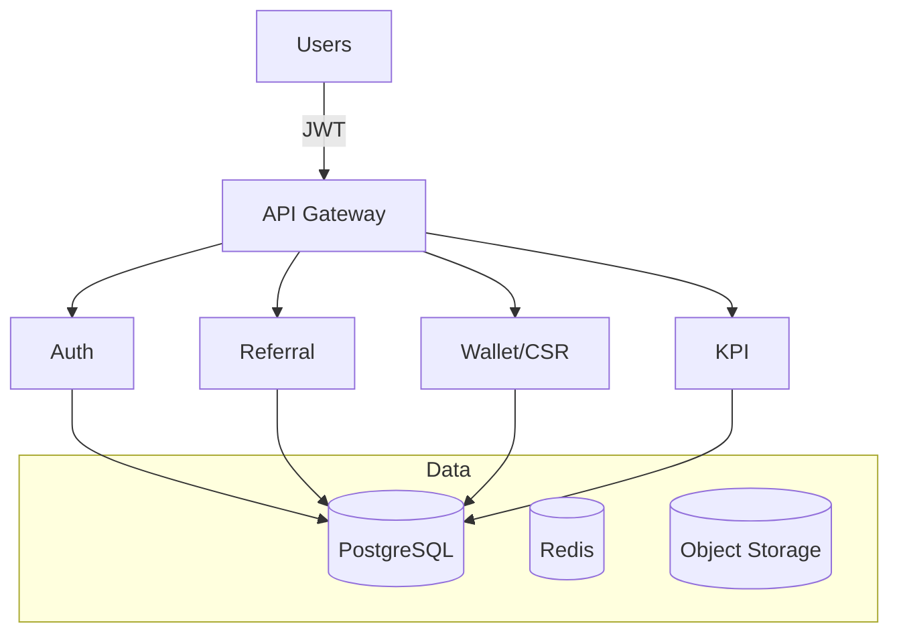

# NOMU System Blueprint (Prototype)

- Clients (Web/Mobile) per role.
- API Gateway -> Auth, Child Journey, Health, Education, Referral, Wallet/CSR, KPIs.
- PostgreSQL + Redis + Object Storage.
- Integrations: NPHIES, Noor, National SSO.

